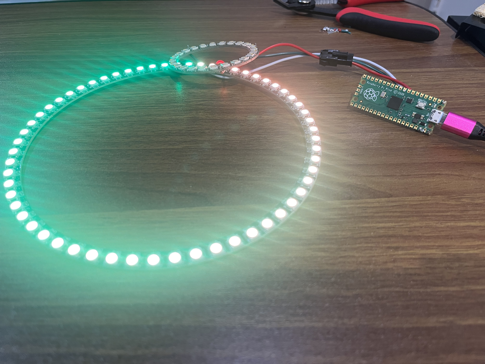
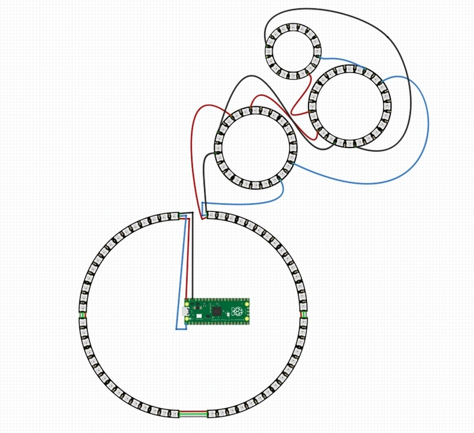

# NeoPixel Ring Lamp with Arduino UNO
<!-- Replace this text with a brief description (2-3 sentences) of your project. This description should draw the reader in and make them interested in what you've built. You can include what the biggest challenges, takeaways, and triumphs from completing the project were. As you complete your portfolio, remember your audience is less familiar than you are with all that your project entails! -->

In this project, I utilized an Arduino Uno to light up four NeoPixel ring lights with special animations. There is one large ring, two medium sized rings, and a final small ring which all get daisy chained to one another. (Will continue with further milestones)

| **Engineer** | **School** | **Area of Interest** | **Grade** |
|:--:|:--:|:--:|:--:|
| Brandon P. | Crescenta Valley Highschool | Computer Engineer | Incoming Senior

**Replace the BlueStamp logo below with an image of yourself and your completed project. Follow the guide [here](https://tomcam.github.io/least-github-pages/adding-images-github-pages-site.html) if you need help.**


  
# Final Milestone : 3D Printed Case
<!-- For your final milestone, explain the outcome of your project. Key details to include are:
- What you've accomplished since your previous milestone
- What your biggest challenges and triumphs were at BSE
- A summary of key topics you learned about
- What you hope to learn in the future after everything you've learned at BSE

**Don't forget to replace the text below with the embedding for your milestone video. Go to Youtube, click Share -> Embed, and copy and paste the code to replace what's below.**--->

Technical Progress
- The final milestone was a 3D printed structure to create an actual lamp. This required use of AutoCAD which is a CAD software.  

Challenges
- A challenge faced was having to learn how to use AutoCAD and create a fesiable structure in just 2 weeks
- Another challenge was the fact that the initial design for the ring structure was too small for the actual rings. This required more prototyping and testing for the ring design
- Another challenge was the size of the 3D printer. It was too small to actually print the large structures. In order to work around this, the CAD structure was broken down into 3 smaller chunks which could be printed and then glued together

Key Learning Points
- CADing : Knowing how to create a 3D model of a project and making it practical for actual use
  
Future Goals
-


<iframe width="560" height="315" src="https://www.youtube.com/embed/F7M7imOVGug" title="YouTube video player" frameborder="0" allow="accelerometer; autoplay; clipboard-write; encrypted-media; gyroscope; picture-in-picture; web-share" allowfullscreen></iframe> 

# Second Milestone : Completed daisy chain between all 4 rings (using Arduino UNO)
<!-- For your second milestone, explain what you've worked on since your previous milestone. You can highlight:
- Technical details of what you've accomplished and how they contribute to the final goal
- What has been surprising about the project so far
- Previous challenges you faced that you overcame
- What needs to be completed before your final milestone 

**Don't forget to replace the text below with the embedding for your milestone video. Go to Youtube, click Share -> Embed, and copy and paste the code to replace what's below.** -->

Technical Progress
- The second milestone was to connect all four of the NeoPixel rings together in a daisy chain and get them to be operational using an Arduino UNO. This was done by soldering the proper wires to the correct ports, keeping in mind the data in and out ports especially, and re-coding the processes in the Arduino.
- Another aspect was the addition of a seperate button which would be used to manually switch the pattern on the ring.


Challenges
  - A challenge faced for the second milestone was the change from a Raspberry Pi Pico to an Arduino UNO. This was challenging as it required me to redo all the previous code and practically start from scratch
  - When daisy chaining the rings to one another, it is important to note which pins are inserted into which ports

Future Milestones
- Looking forward, some challenges and changes to address are:
  
  ```
  1. Create a lamp structure in orde which hold the ring lights
  2. Implement more patterns for the ring lamp
  ```
  
<iframe width="560" height="315" src="https://www.youtube.com/embed/y3VAmNlER5Y" title="YouTube video player" frameborder="0" allow="accelerometer; autoplay; clipboard-write; encrypted-media; gyroscope; picture-in-picture; web-share" allowfullscreen></iframe>

# First Milestone : Functionality in the first ring (using Raspberry Pi Pico)
<!-- For your first milestone, describe what your project is and how you plan to build it. You can include:
- An explanation about the different components of your project and how they will all integrate together
- Technical progress you've made so far
- Challenges you're facing and solving in your future milestones
- What your plan is to complete your project -->

Technical Progress
- The goal of the first milestone was to connect the first ring to the raspberry pi pico in order to check for functionality. This was done by using the connectors already soldered onto the ring. By observing the circuit diagram provided which specified which ports the connectors should be inserted into.



Challenges
- One challenge faced during the coding was being mindful of which wire connects to which port on the Raspberry Pi. The NeoPixel ring lamp came with 4 presoldered joints, each labeled differently and two of them (5V and GND) having two different wires coming out from same the joint. It was important to discern which wire was the data in and which one was the data out and making sure that it is the data in which goes into the correct port in the raspberry pi pico.

Future Milestones
- Looking forward, some challenges and changes to address are:
  
  ```
  1. Switch to an Arduino Uno due to trouble with the coding process
  2. Daisy chain the other ring lights off of the main light
  3. Solder the wires to the ports to ensure a stable connection
  ```

**Don't forget to replace the text below with the embedding for your milestone video. Go to Youtube, click Share -> Embed, and copy and paste the code to replace what's below.**

<iframe width="560" height="315" src="https://www.youtube.com/embed/CaCazFBhYKs" title="YouTube video player" frameborder="0" allow="accelerometer; autoplay; clipboard-write; encrypted-media; gyroscope; picture-in-picture; web-share" allowfullscreen></iframe>

# Schematics 
<!-- Here's where you'll put images of your schematics. [Tinkercad](https://www.tinkercad.com/blog/official-guide-to-tinkercad-circuits) and [Fritzing](https://fritzing.org/learning/) are both great resoruces to create professional schematic diagrams, though BSE recommends Tinkercad becuase it can be done easily and for free in the browser. -->
This is the circuit diagram for the daisy chaining process.



# Code
<!-- Here's where you'll put your code. The syntax below places it into a block of code. Follow the guide [here]([url](https://www.markdownguide.org/extended-syntax/)) to learn how to customize it to your project needs. -->

This is the code for the Arduino UNO

```
#include <Adafruit_NeoPixel.h>
 
#define PIN 6
#define BUTTON_PIN 8 // Change this to the pin number where you connect the button

Adafruit_NeoPixel strip = Adafruit_NeoPixel(124, PIN, NEO_GRB + NEO_KHZ800);
int patternIndex = 0;

int buttonState = HIGH;        // current state of the button
int lastButtonState = HIGH;    // previous state of the button

void setup() {
  strip.begin();
  strip.setBrightness(30);
  strip.show();

  pinMode(BUTTON_PIN, INPUT_PULLUP);  // Configure the button pin as INPUT with internal pull-up resistor
}

void loop() {
  // Read the state of the button
  buttonState = digitalRead(BUTTON_PIN);

  // Check if the button is pressed (LOW level)
  if (buttonState == LOW && lastButtonState == HIGH) {
    // Button is pressed, trigger the next pattern
    patternIndex++;
    changePattern();
    delay(200);  // Debounce delay to avoid multiple triggers from a single press
  }

  // Save the current button state for the next iteration
  lastButtonState = buttonState;
}

void changePattern() {
  switch (patternIndex) {
    case 0:
      colorWipe(strip.Color(255, 0, 0), 50); // Red
      break;
    case 1:
      colorWipe(strip.Color(0, 255, 0), 50); // Green
      break;
    case 2:
      colorWipe(strip.Color(0, 0, 255), 50); // Blue
      break;
    case 3:
      rainbow(20); // Adjust the wait time for slower/faster animation
      break;
    case 4:
      rainbowCycle(20); // Adjust the wait time for slower/faster animation
      break;
    case 5:
      theaterChase(strip.Color(127, 127, 127), 50); // White theater chase
      break;
    case 6:
      blinkAll(strip.Color(255, 255, 0), 500); // Yellow blink
      break;
    case 7:
      fibonacciPattern(200);
      break;
    // Add more cases for additional patterns
      
    default:
      patternIndex = 0; // Reset to the first pattern
      break;
  }
  
  patternIndex++; // Move to the next pattern
  
  delay(1000); // Delay between pattern changes
}
 

// Fill the dots one after the other with a color
void colorWipe(uint32_t c, uint8_t wait) {
  for (uint32_t i = 0; i < strip.numPixels(); i++) {
    strip.setPixelColor(i, c);
    strip.show();
    delay(wait);
  }
}
 
void rainbow(uint8_t wait) {
  uint32_t i, j;
 
  for (j = 0; j < 256; j++) {
    for (i = 0; i < strip.numPixels(); i++) {
      strip.setPixelColor(i, Wheel((i + j) & 255));
    }
    strip.show();
    delay(wait);
  }
}
 
void rainbowCycle(uint8_t wait) {
  uint32_t i, j;
 
  for (j = 0; j < 256 * 5; j++) { // 5 cycles of all colors on wheel
    for (i = 0; i < strip.numPixels(); i++) {
      strip.setPixelColor(i, Wheel(((i * 256 / strip.numPixels()) + j) & 255));
    }
    strip.show();
    delay(wait);
  }
}

void theaterChase(uint32_t c, uint8_t wait) {
  for (int j = 0; j < 100; j++) {  // Repeat 10 times for theater effect
    for (int q = 0; q < 3; q++) {
      for (uint16_t i = 0; i < strip.numPixels(); i = i + 3) {
        strip.setPixelColor(i + q, c);    // Turn every third pixel on
      }
      strip.show();
     
      delay(wait);
     
      for (uint16_t i = 0; i < strip.numPixels(); i = i + 3) {
        strip.setPixelColor(i + q, 0);    // Turn every third pixel off
      }
    }
  }
  strip.show(); // Turn off all pixels at the end
}

void blinkAll(uint32_t c, uint16_t duration) {
  for (int i = 0; i < strip.numPixels(); i++) {
    strip.setPixelColor(i, c);    // Set all pixels to the specified color
  }
  strip.show();
  delay(duration);
  
  for (int i = 0; i < strip.numPixels(); i++) {
    strip.setPixelColor(i, 0);    // Turn off all pixels
  }
  strip.show();
  delay(duration);
}

void fibonacciPattern(uint8_t wait) {
  // Define the initial Fibonacci sequence
  uint8_t fibonacciSequence[] = {1, 1, 2, 3, 5, 8, 13, 21, 34};
  uint8_t sequenceSize = sizeof(fibonacciSequence);
  
  // Iterate through the Fibonacci sequence
  for (uint8_t i = 0; i < sequenceSize; i++) {
    uint8_t numPixels = fibonacciSequence[i];
    
    // Set the specified number of pixels to a color
    for (uint8_t j = 0; j < numPixels; j++) {
      strip.setPixelColor(j, strip.Color(255, 0, 0));  // Set the color (here, red)
    }
    strip.show();  // Show the updated pixels
    
    delay(wait);
    
    // Turn off all pixels
    for (uint8_t j = 0; j < strip.numPixels(); j++) {
      strip.setPixelColor(j, strip.Color(0, 0, 0));  // Turn off the pixel
    }
    strip.show();  // Show the updated pixels
    
    delay(wait);
  }
}

uint32_t Wheel(byte WheelPos) {
  if (WheelPos < 85) {
    return strip.Color(WheelPos * 3, 255 - WheelPos * 3, 0);
  } else if (WheelPos < 170) {
    WheelPos -= 85;
    return strip.Color(255 - WheelPos * 3, 0, WheelPos * 3);
  } else {
    WheelPos -= 170;
    return strip.Color(0, WheelPos * 3, 255 - WheelPos * 3);
  }
}

```

This is the code for the Raspberry Pi Pico in the first milestone.

```
# # SPDX-FileCopyrightText: 2021 Ruiz Brothers for Adafruit Industries
# # SPDX-License-Identifier: MIT

import board
import neopixel
from adafruit_led_animation.animation.pulse import Pulse
from adafruit_led_animation.animation.rainbow import Rainbow
from adafruit_led_animation.animation.rainbowsparkle import RainbowSparkle
from adafruit_led_animation.animation.rainbowcomet import RainbowComet
from adafruit_led_animation.sequence import AnimationSequence
from adafruit_led_animation.color import PURPLE

# Update this to match the number of NeoPixel LEDs connected to your board.
num_pixels_large = 84
 
large_pixels = neopixel.NeoPixel(board.GP0, num_pixels_large, auto_write=True)
large_pixels.brightness = 0.2

##############################################   Animations   #########################################################
 
rainbow_large = Rainbow(large_pixels, speed=0.01, period=1)
rainbow_sparkle_large  = RainbowSparkle(large_pixels, speed=0.05, num_sparkles=15)
rainbow_comet_large  = RainbowComet(large_pixels, speed=.01, tail_length=20, bounce=True)
pulse_large  = Pulse(large_pixels, speed=.05, color=PURPLE, period=3)

 
##############################################   Sequencing   #########################################################
animations = AnimationSequence(
     rainbow_large,

     advance_interval = 5,
     auto_clear=True,
     random_order=False
)

while True:
     animations.animate()

```

# Bill of Materials
Here's where you'll list the parts in your project. To add more rows, just copy and paste the example rows below.
Don't forget to place the link of where to buy each component inside the quotation marks in the corresponding row after href =. Follow the guide [here]([url](https://www.markdownguide.org/extended-syntax/)) to learn how to customize this to your project needs. 

| **Part** | **Quantity** | **Note** | **Price** | **Link** |
|:--:|:--:|:--:|:--:|:--:|
| Raspberry Pi Pico RP2040 | 1 | The main computing board | $4.00 | <a href="https://www.amazon.com/Arduino-A000066-ARDUINO-UNO-R3/dp/B008GRTSV6/"> [Link](https://www.adafruit.com/product/4864) </a> |
|:--:|:--:|:--:|:--:|:--:|
| NeoPixel 1/4 60 Ring - 5050 RGB LED | 4 | The main ring light w/ 60 LEDs | $39.80 | <a href="https://www.amazon.com/Arduino-A000066-ARDUINO-UNO-R3/dp/B008GRTSV6/"> [Link](https://www.adafruit.com/product/1768) </a> |
|:--:|:--:|:--:|:--:|:--:|
| NeoPixel Ring - 24 x 5050 RGB LED | 2 | The medium ring lights w/ 24 LEDs  | $33.90 | <a href="https://www.amazon.com/Arduino-A000066-ARDUINO-UNO-R3/dp/B008GRTSV6/"> [Link](https://www.adafruit.com/product/1586) 
 </a> |
|:--:|:--:|:--:|:--:|:--:|
| NeoPixel Ring - 16 x 5050 RGB LED | 1 | The small ring light w/ 16 LEDs | $9.95 | <a href="https://www.amazon.com/Arduino-A000066-ARDUINO-UNO-R3/dp/B008GRTSV6/"> [Link](https://www.adafruit.com/product/1463) </a> |
|:--:|:--:|:--:|:--:|:--:|
| 1.25 mm Pitch 3-pin Cable Matching Pair | 10 | Used to daisy chain the ring lights | $8.60 | <a href="https://www.amazon.com/Arduino-A000066-ARDUINO-UNO-R3/dp/B008GRTSV6/"> [Link](https://www.adafruit.com/product/4721) </a> |
|:--:|:--:|:--:|:--:|:--:|
| Plusivo Soldering Kit | 1 | Used to solder the joints together | $19.99 | <a href="https://www.amazon.com/Arduino-A000066-ARDUINO-UNO-R3/dp/B008GRTSV6/"> [Link](https://www.amazon.com/Soldering-Iron-Kit-Temperature-Desoldering/dp/B07S61WT16/ref=sr_1_3?hvadid=334681349713&hvdev=c&hvlocphy=9112892&hvnetw=g&hvqmt=e&hvrand=14699565686943286206&hvtargid=kwd-645860950266&hydadcr=24633_10399729&keywords=plusivo+soldering+kit&qid=1687534558&sr=8-3) </a> |
|:--:|:--:|:--:|:--:|:--:|

# Other Resources/Examples
One of the best parts about Github is that you can view how other people set up their own work. Here are some past BSE portfolios that are awesome examples. You can view how they set up their portfolio, and you can view their index.md files to understand how they implemented different portfolio components.
- [Example 1](https://trashytuber.github.io/YimingJiaBlueStamp/)
- [Example 2](https://sviatil0.github.io/Sviatoslav_BSE/)
- [Example 3](https://arneshkumar.github.io/arneshbluestamp/)

To watch the BSE tutorial on how to create a portfolio, click here.
